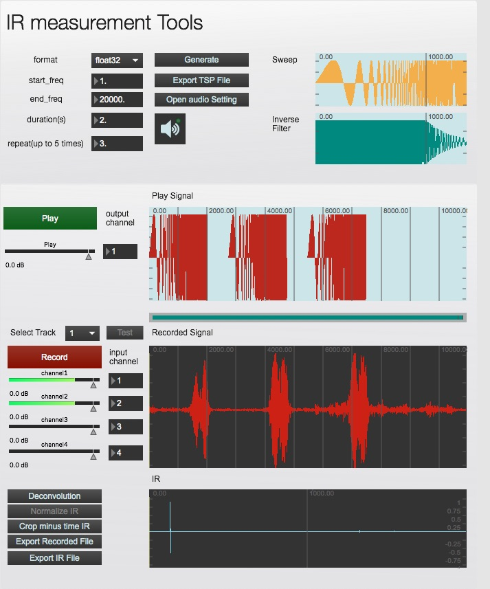

# IR_measurement_toolbox

Impulse response measurement application with ESS method, purely made with Max/MSP/Jitter/Gen.

## Features

- Generate a test signal, record, and generate IR as wav file, all in the single patch.
- No external dependencies (it generates test signal with non-signal `gen`, calculates non-RT convolution/deconvolution with `jit.fft`.)
- Can generate test signals both of linear/log(Exponential) Swept Sine algorithms.
- Can record up to 4 audio channels at the same time.
- Can handle a test signal repetition & taking an average of them.
- 
## Updates

(2023-03-08) 

- Fixed the problem that the initial phase was wrong in the calculation of Log-SS.
- Fixed the problem that the calculation fails when the number of samples of the test signal is larger than 100000 samples (due to the limitation of the for-loop in genexpr.)

(2018-09-27)

With the arrival of event-based gen, updated a part of sine-sweep signal generation from gen~ to gen(event base).
Thanks to gen, now it can generate the test signal in a moment.

## References 

"ExpoChirpToolbox: a Pure Data implementation of ESS impulse response measurement", Katja Vetter & Serafino di Rosario (2011), https://wwws.uni-weimar.de/kunst-und-gestaltung/wiki/images/ExpoChirpToolbox-_a_Pd_implementation_of_ESS_impulse_response_measurement.pdf 

"Simultaneous Measurement of Impulse Response and Distortion with a Swept-Sine Technique", Angelo Farina(2000), pre-print of the 108th AES Convention, 19-22 

"Impulse Response Measurements",Angelo Farina, paper for the 23rd Nordic Sound Symposium, 27-30 September 2007. http://pcfarina.eng.unipr.it/Public/Presentations/aes122-farina.pdf 

## Making (in Japanese)

<http://matsuuratomoya.com/blog/2016-06-11/log-sinsesweep-jitter-gen/>

## [License](LICENSE)

The MIT License (MIT)

Copyright (c) 2016 Tomoya Matsuura

Permission is hereby granted, free of charge, to any person obtaining a copy
of this software and associated documentation files (the "Software"), to deal
in the Software without restriction, including without limitation the rights
to use, copy, modify, merge, publish, distribute, sublicense, and/or sell
copies of the Software, and to permit persons to whom the Software is
furnished to do so, subject to the following conditions:

The above copyright notice and this permission notice shall be included in all
copies or substantial portions of the Software.

THE SOFTWARE IS PROVIDED "AS IS", WITHOUT WARRANTY OF ANY KIND, EXPRESS OR
IMPLIED, INCLUDING BUT NOT LIMITED TO THE WARRANTIES OF MERCHANTABILITY,
FITNESS FOR A PARTICULAR PURPOSE AND NONINFRINGEMENT. IN NO EVENT SHALL THE
AUTHORS OR COPYRIGHT HOLDERS BE LIABLE FOR ANY CLAIM, DAMAGES OR OTHER
LIABILITY, WHETHER IN AN ACTION OF CONTRACT, TORT OR OTHERWISE, ARISING FROM,
OUT OF OR IN CONNECTION WITH THE SOFTWARE OR THE USE OR OTHER DEALINGS IN THE
SOFTWARE.

## Author

[Matsuura Tomoya](http://matsuuratomoya.com)

